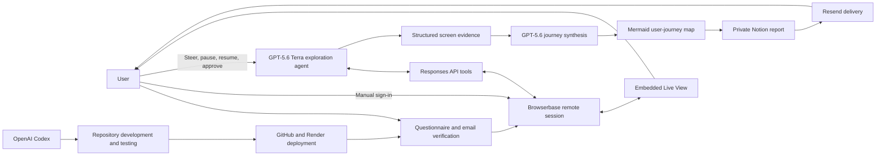

# Synthetic PM

> **An AI product-intelligence agent that enters real software, explores it like a product manager, and maps the actual user journey.**

**Built with OpenAI Codex. Powered at runtime by GPT‑5.6 Terra.**

Synthetic PM opens a real product in a shared remote browser, lets the user sign in securely, and then explores the interface while the user watches. The agent records meaningful product states, identifies workflows and gates, and produces a structured Mermaid user-journey map rather than a generic product summary.

**Live:** [syntheticpm.com](https://syntheticpm.com)

---

## Why Synthetic PM

Product research is often shallow because it relies on:

- marketing pages instead of the logged-in product,
- static screenshots instead of connected workflows,
- feature inventories instead of user journeys,
- manual exploration that is difficult to reproduce,
- and summaries that lose the relationship between product components.

Synthetic PM is designed to investigate the product itself.

A typical run:

1. The user submits a product URL and verifies their email.
2. Synthetic PM creates a remote Browserbase session.
3. The user signs in manually; credentials are never given to the agent.
4. GPT‑5.6 Terra explores the product through computer-use tools.
5. The user watches, pauses, resumes, steers, answers questions, and approves consequential actions.
6. Synthetic PM records meaningful screens and product states.
7. GPT‑5.6 synthesizes the evidence into a structured user-journey map.
8. The report is published privately in Notion and delivered by email.

---

## OpenAI inside the project

### Codex: the engineering collaborator

[OpenAI Codex](https://openai.com/codex/) is used for repository-level software development rather than as part of the customer-facing runtime.

Codex helps maintain Synthetic PM by:

- reading and understanding the repository,
- implementing backend and frontend changes,
- tracing bugs across long agent workflows,
- running syntax checks and local commands,
- reviewing changes before deployment,
- preserving product decisions through repository documentation,
- and maintaining a clean handoff between product discussions and executable code.

The repository includes a dedicated Codex handoff structure:

```text
docs/
├── CODEX_HANDOFF.md
├── DECISION_LOG.md
└── CHAT_TRANSCRIPT.md
```

Codex is instructed to read the curated handoff and decision log before changing production behavior. This reduces the risk of restoring obsolete logic or over-optimizing the agent around one test product.

> **Codex builds and maintains Synthetic PM. It is not the model controlling the live product exploration.**

### GPT‑5.6 Terra: the runtime product explorer

Synthetic PM uses the OpenAI Responses API with:

```env
OPENAI_MODEL=gpt-5.6-terra
OPENAI_REASONING_EFFORT=high
```

GPT‑5.6 Terra drives the live exploration agent through:

- computer use,
- structured function calling,
- screenshot inspection,
- multi-turn state management,
- concise human-visible agent notes,
- consequential-action approval requests,
- and evidence-based product-journey synthesis.

The exploration loop manually replays conversation history rather than relying only on `previous_response_id`. This was introduced after production testing showed that an initial computer-use request could succeed while a stateful continuation failed.

For final journey synthesis, the same model is configured separately:

```env
JOURNEY_REASONING_EFFORT=medium
JOURNEY_MAX_TOKENS=8000
JOURNEY_RETRY_MAX_TOKENS=12000
```

The synthesis step receives the recorded product evidence and returns a Mermaid flowchart through a strict function call. A second attempt is made when the first response is incomplete, invalid, or missing the required tool output.

> **GPT‑5.6 Terra explores the product. Codex evolves the product that performs the exploration.**

---

## Product architecture



---

## Core capabilities

### Real product exploration

The agent uses a live remote browser rather than a recording or static scrape. It can inspect authenticated product states after the user signs in.

### Human-in-the-loop control

During a run, the user can:

- watch the shared browser,
- steer the agent,
- pause and resume exploration,
- browse manually while paused,
- answer agent questions,
- and approve or deny consequential actions.

### Credential boundary

The user signs in manually. Synthetic PM does not ask the model to collect, store, or type the user’s password.

### Consequential-action protection

The agent must request approval before actions such as:

- sending or posting,
- connecting an external account,
- purchasing or upgrading,
- deleting data,
- changing permissions,
- or transmitting sensitive information.

### Human-visible agent notes

The log includes concise summaries such as:

```text
AGENT NOTE:
The breadth pass is complete. I’m using the remaining credits to inspect
the most important workflow beyond its landing page.
```

These notes communicate conclusions and observable evidence. They do not expose hidden chain-of-thought.

### Meaningful exploration credits

The free trial includes:

```text
30 meaningful exploration credits
```

Credits are consumed by actions that materially advance the exploration:

- click,
- double-click,
- drag,
- typing,
- and keypress.

Mechanical browser operations do not consume credits:

- screenshot,
- wait,
- scroll,
- pointer movement,
- screen recording,
- and agent notes.

Internal safeguards still cap each run at:

```text
100 raw browser operations
70 model iterations
```

### Structured journey reports

The final output is intended to show:

- core workflows,
- product components,
- prerequisites,
- decision points,
- permission or subscription gates,
- empty and error states,
- and cross-workflow relationships.

A flat product-to-screen inventory is not treated as a successful final journey.

---

## Reliability and observability

### Exploration failure state

If the exploration model fails, the dashboard displays an explicit failure state. The system does not present an empty report as a completed run.

### Journey-generation retry

Journey synthesis:

1. runs with medium reasoning and an 8,000-token output allowance,
2. validates completion and Mermaid output,
3. retries once with a 12,000-token allowance,
4. and reports a visible failure if both attempts fail.

The old deterministic star-shaped fallback is not silently presented as a successful user journey.

### Structured API failure logging

Instrumented failures include:

- OpenAI exploration requests,
- OpenAI journey synthesis,
- Browserbase session creation,
- Browserbase Live View retrieval,
- Notion publishing and screenshot uploads,
- Resend confirmation emails,
- and Resend report emails.

Each record may contain:

```text
timestamp
provider
operation
model
session prefix
hashed email
target product
credits used
raw browser operations
HTTP status
error code
request ID
safe diagnostic metadata
```

The logger intentionally excludes:

- API keys,
- authorization headers,
- cookies,
- passwords,
- raw email addresses,
- prompts,
- screenshots,
- and image contents.

Failures are written to:

```text
Render stdout using [API_FAILURE]
runs/api_failures.jsonl
private Notion page: _Synthetic PM API Failure Log
```

---

## Trial behavior

- One free exploration per verified email.
- Emails are normalized before checking eligibility.
- Trial state is persisted through a private Notion ledger.
- Shared IP addresses are not hard-blocked.
- Founder and internal testing addresses can be configured through:

```env
TRIAL_BYPASS_EMAILS=founder@example.com,tester@example.com
```

The private ledger page is named:

```text
_Synthetic PM Trial Ledger
```

---

## Technology stack

| Layer | Technology |
|---|---|
| Runtime agent | OpenAI GPT‑5.6 Terra |
| Agent API | OpenAI Responses API |
| Development agent | OpenAI Codex |
| Remote browser | Browserbase |
| Browser automation | Playwright over CDP |
| Reports and persistent operational records | Notion API |
| Transactional email | Resend |
| Backend | Node.js ES modules |
| Hosting | Render |
| Source control | GitHub |

---

## Repository structure

```text
.
├── backend.mjs
├── package.json
├── package-lock.json
├── render.yaml
├── public/
│   ├── index.html
│   └── how-it-works.html
├── docs/
│   ├── CODEX_HANDOFF.md
│   ├── DECISION_LOG.md
│   └── CHAT_TRANSCRIPT.md
└── runs/
    ├── api_failures.jsonl
    └── <session artifacts>
```

The `runs/` directory contains local runtime artifacts and should not be treated as durable storage on an ephemeral hosting filesystem.

---

## Local setup

### Requirements

- Node.js
- npm
- Browserbase project
- OpenAI API project with access to GPT‑5.6 Terra
- Resend account
- Notion integration and parent page

### Install

```bash
git clone <your-repository-url>
cd synthetic-pm
npm install
```

### Configure the environment

Create a `.env` file in the repository root:

```env
BROWSERBASE_API_KEY=
BROWSERBASE_PROJECT_ID=

OPENAI_API_KEY=
OPENAI_MODEL=gpt-5.6-terra
OPENAI_REASONING_EFFORT=high

RESEND_API_KEY=
FROM_EMAIL=Synthetic PM <hello@updates.syntheticpm.com>

NOTION_API_KEY=
NOTION_PARENT_PAGE=

BASE_URL=http://localhost:4000
PORT=4000

TRIAL_BYPASS_EMAILS=

JOURNEY_REASONING_EFFORT=medium
JOURNEY_MAX_TOKENS=8000
JOURNEY_RETRY_MAX_TOKENS=12000
```

Do not commit `.env`.

### Validate

```bash
npm run check
```

A successful syntax check returns silently.

### Run

```bash
npm start
```

Open:

```text
http://localhost:4000
```

Health check:

```text
http://localhost:4000/health
```

---

## Deployment

The current deployment flow is:

```text
Local repository
→ GitHub main branch
→ Render auto-deploy
→ syntheticpm.com
```

Before pushing:

```bash
npm run check
```

Recommended deployment checks:

1. Confirm the Render build succeeds.
2. Confirm `/health` returns an OK response.
3. Submit a test run using a bypass email.
4. Verify Browserbase Live View.
5. Pause and resume the agent.
6. Confirm the action counter uses credits.
7. Verify the final Mermaid journey.
8. Review `_Synthetic PM API Failure Log` for new errors.

---

## Questionnaire

### Title

**Synthetic PM: Your product intel wingman**

### Subtitle

**Point it at a product — it maps the real user journey.**

### Trial instructions

- Use a real email for access and reports.
- 1 free exploration per verified email.
- 30 exploration credits per trial.
- Create the product account before starting.

### Required questions

- Name
- Work email
- Role
- Product ownership
- Product URL

### Optional questions

- Focus area
- WhatsApp or phone number

Focus placeholder:

```text
e.g. pricing page, profiles, settings
```

---

## Development with Codex

When opening the repository in Codex, start with:

```text
Read docs/CODEX_HANDOFF.md first, then docs/DECISION_LOG.md.

Inspect backend.mjs, package.json, render.yaml, public/, and recent Git history.

Before modifying code:
1. summarize the current architecture,
2. identify the active production behavior,
3. distinguish production code from experimental code,
4. list the exact files and functions you plan to change,
5. preserve trial limits, credential boundaries, consequential-action
   approval, meaningful-credit accounting, pause/resume, agent notes,
   report reliability, and API-failure logging.

Synthetic PM must work across different products. Do not optimize its
exploration prompt around one test product.
```

---

## Current status

Synthetic PM is an early working product.

The current version supports:

- verified-email trial access,
- live authenticated product exploration,
- GPT‑5.6 Terra computer use,
- pause and resume,
- human steering,
- consequential-action approval,
- meaningful exploration credits,
- structured evidence recording,
- retried journey synthesis,
- private Notion reports,
- transactional email,
- and structured API-failure logging.

Areas still under evaluation include:

- the optimal balance between breadth and workflow depth,
- public report delivery outside private Notion access,
- trial refunds after infrastructure failures,
- and whether a structured exploration-plan tool improves general output enough to justify added complexity.

---

## Privacy and security notes

- User credentials remain under user control.
- API secrets belong only in environment variables.
- Raw email addresses are not stored in API failure logs.
- Prompts and screenshots are excluded from the structured failure log.
- Consequential actions require explicit user approval.
- Notion report accessibility should be reviewed before broader public use.

---

## License

No open-source license has been granted yet. Unless a license is added, the repository should be treated as proprietary.

---

## Acknowledgements

Synthetic PM is developed with [OpenAI Codex](https://openai.com/codex/) and uses the [OpenAI GPT‑5.6](https://openai.com/index/gpt-5-6/) family through the Responses API.

Remote browser infrastructure is provided by Browserbase, browser automation by Playwright, report storage by Notion, email delivery by Resend, and hosting by Render.
